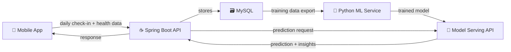

# 🧠 ADHD Tracker — Custom AI Model Blueprint

Everything you need to build, train, and deploy a custom AI model for ADHD pattern prediction and coaching, integrated into your Hunter System.

---

## The Big Picture



You're building **3 things**:
1. **Data collection layer** — Spring Boot backend (Java, what you already have)
2. **Training pipeline** — Python scripts that train the model offline
3. **Model serving API** — Python microservice that serves predictions in real-time

---

## Phase 1: Data Collection (Build Now — In Java)

> [!IMPORTANT]
> **You cannot train a model without data.** This phase must come first. You need **minimum 30-60 days** of daily logs before training produces anything meaningful.

### What to collect every day

| Feature | Type | Source | Why |
|---------|------|--------|-----|
| `mood` | enum (1-5) | User input | Target variable |
| `energyLevel` | int (1-5) | User input | Target variable |
| `focusLevel` | int (1-5) | User input | Target variable |
| `medsTaken` | boolean | User input | Key predictor |
| `medTime` | LocalTime | User input | Timing matters for meds |
| `sleepHours` | float | Health Connect | Strongest predictor for ADHD |
| `steps` | int | Health Connect | Activity correlation |
| `avgHeartRate` | int | Health Connect | Stress/anxiety indicator |
| `questsCompleted` | int | Task system | Productivity metric |
| `xpEarned` | int | Task system | Productivity metric |
| `dayOfWeek` | int (1-7) | Auto | Weekly patterns |
| `triggers` | List\<String\> | User input | Pattern detection |
| `screenTime` | float (hours) | Optional | Distraction metric |
| `caffeineIntake` | int (cups) | Optional | Affects focus |
| `exerciseMinutes` | int | Optional / Health Connect | Affects everything |
| `notes` | text | User input | For NLP later |

### Database schema

```sql
CREATE TABLE adhd_logs (
    id BIGINT AUTO_INCREMENT PRIMARY KEY,
    user_id BIGINT NOT NULL,
    log_date DATE NOT NULL,
    
    -- User-reported (daily check-in)
    mood INT NOT NULL,              -- 1=terrible, 2=bad, 3=okay, 4=good, 5=great
    energy_level INT NOT NULL,      -- 1-5
    focus_level INT NOT NULL,       -- 1-5
    meds_taken BOOLEAN DEFAULT FALSE,
    med_time TIME,
    triggers JSON,                  -- ["poor_sleep", "skipped_meals", "stress"]
    notes TEXT,
    
    -- Auto-populated from Health Connect
    sleep_hours FLOAT,
    steps INT,
    avg_heart_rate INT,
    exercise_minutes INT,
    
    -- Auto-populated from task system
    quests_completed INT DEFAULT 0,
    xp_earned INT DEFAULT 0,
    
    -- Metadata
    created_at TIMESTAMP DEFAULT CURRENT_TIMESTAMP,
    
    UNIQUE KEY unique_user_date (user_id, log_date),
    FOREIGN KEY (user_id) REFERENCES users(id)
);
```

### Data volume needed

| Model Type | Minimum Data | Ideal Data | Time to Collect |
|-----------|-------------|------------|-----------------|
| Basic correlations | 14 days | 30 days | 2-4 weeks |
| Random Forest / XGBoost | 60 days | 180 days | 2-6 months |
| LSTM / Neural Network | 180 days | 365+ days | 6-12 months |
| Fine-tuned LLM | N/A (use pre-existing) | + your data for context | N/A |

---

## Phase 2: The Model — What to Build

### Model Architecture (Recommended: Hybrid Approach)

You're building **two models**, not one:

#### Model A: Prediction Model (Classical ML)
- **What it does**: Predicts tomorrow's mood/focus/energy based on today's data
- **Algorithm**: Gradient Boosting (XGBoost) or Random Forest
- **Why not deep learning**: You have ONE user. Deep learning needs thousands of data points. Classical ML works great with 60-200 rows.
- **Retrains**: Weekly (automated cron job)

#### Model B: Pattern & Insight Engine (LLM-based)
- **What it does**: Generates natural language insights, weekly summaries, and coaching
- **Options**:
  - **Fine-tune a small LLM** (Phi-3 Mini 3.8B, Mistral 7B) on ADHD coaching data
  - **OR** use Gemini/OpenAI API with structured prompts + your data as context
- **Recommendation**: Start with API calls, fine-tune later only if you need offline/privacy

---

## Phase 3: Training Pipeline (Python)

### Project structure

```
adhd-model/
├── data/
│   ├── raw/                    # CSV exports from MySQL
│   ├── processed/              # Feature-engineered datasets
│   └── sample/                 # Sample data for testing
├── models/
│   ├── saved/                  # Serialized trained models (.joblib)
│   └── configs/                # Hyperparameter configs
├── notebooks/
│   ├── 01_eda.ipynb           # Exploratory data analysis
│   ├── 02_feature_eng.ipynb   # Feature engineering experiments
│   └── 03_model_eval.ipynb    # Model comparison & evaluation
├── src/
│   ├── __init__.py
│   ├── data_loader.py          # Pull data from MySQL / CSV
│   ├── features.py             # Feature engineering pipeline
│   ├── train.py                # Training script
│   ├── predict.py              # Prediction logic
│   ├── evaluate.py             # Metrics & evaluation
│   └── export.py               # Export model for serving
├── api/
│   ├── app.py                  # FastAPI serving endpoint
│   ├── schemas.py              # Pydantic request/response models
│   └── Dockerfile              # Container for model API
├── requirements.txt
├── train.sh                    # One-command training
└── README.md
```

### Tech stack

| Tool | Purpose | Install |
|------|---------|---------|
| **Python 3.11+** | Language | `python.org` |
| **pandas** | Data manipulation | `pip install pandas` |
| **numpy** | Numerical computation | `pip install numpy` |
| **scikit-learn** | ML algorithms, pipelines | `pip install scikit-learn` |
| **xgboost** | Gradient boosting (best for tabular data) | `pip install xgboost` |
| **joblib** | Model serialization | included with sklearn |
| **matplotlib / seaborn** | Data visualization | `pip install matplotlib seaborn` |
| **FastAPI** | Model serving API | `pip install fastapi uvicorn` |
| **mysql-connector-python** | Pull data from your DB | `pip install mysql-connector-python` |
| **jupyter** | Notebook exploration | `pip install jupyter` |

```
pip install pandas numpy scikit-learn xgboost matplotlib seaborn fastapi uvicorn mysql-connector-python jupyter
```

### Feature Engineering (`features.py`)

This is THE most important part of classical ML. Raw data → model-ready features:

```python
import pandas as pd
import numpy as np

def engineer_features(df: pd.DataFrame) -> pd.DataFrame:
    """Transform raw ADHD logs into ML-ready features."""
    
    df = df.sort_values('log_date').copy()
    
    # ── Time features ──────────────────────────────────────
    df['day_of_week'] = pd.to_datetime(df['log_date']).dt.dayofweek  # 0=Mon
    df['is_weekend'] = df['day_of_week'].isin([5, 6]).astype(int)
    df['month'] = pd.to_datetime(df['log_date']).dt.month
    
    # ── Lag features (yesterday's values) ──────────────────
    for col in ['mood', 'energy_level', 'focus_level', 'sleep_hours', 
                'steps', 'quests_completed']:
        df[f'{col}_lag1'] = df[col].shift(1)    # yesterday
        df[f'{col}_lag2'] = df[col].shift(2)    # 2 days ago
    
    # ── Rolling averages (last 3 days, last 7 days) ────────
    for col in ['mood', 'energy_level', 'focus_level', 'sleep_hours']:
        df[f'{col}_rolling3'] = df[col].rolling(3, min_periods=1).mean()
        df[f'{col}_rolling7'] = df[col].rolling(7, min_periods=1).mean()
    
    # ── Trend features ─────────────────────────────────────
    df['mood_trend'] = df['mood'] - df['mood_rolling7']  # positive = improving
    df['sleep_deficit'] = 8.0 - df['sleep_hours']  # negative = oversleep
    
    # ── Interaction features ───────────────────────────────
    df['meds_x_sleep'] = df['meds_taken'].astype(int) * df['sleep_hours']
    df['activity_score'] = df['steps'] / 1000 + df.get('exercise_minutes', 0) / 30
    
    # ── Trigger encoding ───────────────────────────────────
    common_triggers = ['poor_sleep', 'stress', 'skipped_meals', 
                       'overstimulation', 'boredom', 'rejection']
    for trigger in common_triggers:
        df[f'trigger_{trigger}'] = df['triggers'].apply(
            lambda t: 1 if t and trigger in t else 0
        )
    
    # ── Streak features (from your existing system) ────────
    df['consecutive_productive_days'] = (
        (df['quests_completed'] > 0)
        .groupby((df['quests_completed'] == 0).cumsum())
        .cumsum()
    )
    
    return df.dropna(subset=['mood_lag1'])  # drop first row (no lag data)
```

### Training Script (`train.py`)

```python
import pandas as pd
import numpy as np
from sklearn.model_selection import TimeSeriesSplit, cross_val_score
from sklearn.pipeline import Pipeline
from sklearn.preprocessing import StandardScaler
from sklearn.ensemble import RandomForestRegressor, GradientBoostingRegressor
from xgboost import XGBRegressor
from sklearn.metrics import mean_absolute_error, r2_score
import joblib
from features import engineer_features
from data_loader import load_from_mysql

# ── Config ─────────────────────────────────────────────────
TARGET_COLUMNS = ['mood', 'energy_level', 'focus_level']
FEATURE_COLUMNS = [
    'day_of_week', 'is_weekend', 'meds_taken', 'sleep_hours', 'steps',
    'avg_heart_rate', 'quests_completed', 'xp_earned',
    'mood_lag1', 'mood_lag2', 'energy_level_lag1', 'focus_level_lag1',
    'sleep_hours_lag1', 'mood_rolling3', 'mood_rolling7',
    'focus_level_rolling3', 'sleep_deficit', 'meds_x_sleep',
    'activity_score', 'consecutive_productive_days',
    'trigger_poor_sleep', 'trigger_stress', 'trigger_skipped_meals'
]

def train_model(user_id: int):
    """Train prediction models for a specific user."""
    
    # Load and prepare data
    raw_df = load_from_mysql(user_id)
    df = engineer_features(raw_df)
    
    if len(df) < 30:
        print(f"⚠️ Only {len(df)} data points. Need 30+ for reliable training.")
        return None
    
    # Features and targets
    X = df[FEATURE_COLUMNS].fillna(0)
    
    results = {}
    for target in TARGET_COLUMNS:
        y = df[target]
        
        # Time-series cross-validation (never leak future data)
        tscv = TimeSeriesSplit(n_splits=5)
        
        # Try multiple models
        models = {
            'random_forest': RandomForestRegressor(
                n_estimators=100, max_depth=6, random_state=42
            ),
            'xgboost': XGBRegressor(
                n_estimators=100, max_depth=4, learning_rate=0.1,
                random_state=42, verbosity=0
            ),
            'gradient_boosting': GradientBoostingRegressor(
                n_estimators=100, max_depth=4, random_state=42
            )
        }
        
        best_model = None
        best_score = -999
        
        for name, model in models.items():
            pipe = Pipeline([
                ('scaler', StandardScaler()),
                ('model', model)
            ])
            scores = cross_val_score(pipe, X, y, cv=tscv, 
                                      scoring='neg_mean_absolute_error')
            avg_score = scores.mean()
            print(f"  {target} | {name}: MAE={-avg_score:.3f}")
            
            if avg_score > best_score:
                best_score = avg_score
                best_model = (name, pipe)
        
        # Train best model on all data
        best_model[1].fit(X, y)
        
        # Save
        model_path = f"models/saved/{target}_model.joblib"
        joblib.dump(best_model[1], model_path)
        print(f"  ✅ Saved {best_model[0]} for '{target}' → {model_path}")
        
        # Feature importance
        if hasattr(best_model[1].named_steps['model'], 'feature_importances_'):
            importances = best_model[1].named_steps['model'].feature_importances_
            top_features = sorted(zip(FEATURE_COLUMNS, importances), 
                                  key=lambda x: x[1], reverse=True)[:5]
            print(f"  Top features: {[f'{n}={v:.3f}' for n,v in top_features]}")
        
        results[target] = {
            'model': best_model[0],
            'mae': -best_score,
            'path': model_path
        }
    
    # Save feature list for serving
    joblib.dump(FEATURE_COLUMNS, "models/saved/feature_columns.joblib")
    
    return results

if __name__ == "__main__":
    import sys
    user_id = int(sys.argv[1]) if len(sys.argv) > 1 else 1
    print(f"🧠 Training ADHD prediction models for user {user_id}...")
    results = train_model(user_id)
    if results:
        print("\n📊 Training complete!")
        for target, info in results.items():
            print(f"  {target}: {info['model']} (MAE: {info['mae']:.3f})")
```

### Data Loader (`data_loader.py`)

```python
import pandas as pd
import mysql.connector
import os

def load_from_mysql(user_id: int) -> pd.DataFrame:
    """Load ADHD logs from MySQL for a specific user."""
    
    conn = mysql.connector.connect(
        host=os.getenv('DB_HOST', 'localhost'),
        port=int(os.getenv('DB_PORT', '3306')),
        database=os.getenv('DB_NAME', 'taskdb'),
        user=os.getenv('DB_USER', 'root'),
        password=os.getenv('DB_PASSWORD', 'root123')
    )
    
    query = """
        SELECT 
            al.log_date, al.mood, al.energy_level, al.focus_level,
            al.meds_taken, al.sleep_hours, al.steps, al.avg_heart_rate,
            al.exercise_minutes, al.quests_completed, al.xp_earned,
            al.triggers, al.notes
        FROM adhd_logs al
        WHERE al.user_id = %s
        ORDER BY al.log_date ASC
    """
    
    df = pd.read_sql(query, conn, params=(user_id,))
    conn.close()
    
    # Parse triggers JSON
    import json
    df['triggers'] = df['triggers'].apply(
        lambda x: json.loads(x) if x else []
    )
    
    return df
```

---

## Phase 4: Model Serving API (FastAPI)

### `api/app.py`

```python
from fastapi import FastAPI, HTTPException
from pydantic import BaseModel
from typing import List, Optional
import joblib
import numpy as np
import os

app = FastAPI(title="Hunter ADHD Model API", version="1.0")

# Load models on startup
models = {}
feature_columns = []

@app.on_event("startup")
def load_models():
    global models, feature_columns
    model_dir = os.getenv("MODEL_DIR", "models/saved")
    
    for target in ['mood', 'energy_level', 'focus_level']:
        path = f"{model_dir}/{target}_model.joblib"
        if os.path.exists(path):
            models[target] = joblib.load(path)
            print(f"✅ Loaded model: {target}")
    
    fc_path = f"{model_dir}/feature_columns.joblib"
    if os.path.exists(fc_path):
        feature_columns = joblib.load(fc_path)

class PredictionRequest(BaseModel):
    day_of_week: int
    is_weekend: int
    meds_taken: int
    sleep_hours: float
    steps: int
    avg_heart_rate: Optional[int] = 70
    quests_completed: int = 0
    xp_earned: int = 0
    mood_lag1: float
    mood_lag2: float
    energy_level_lag1: float
    focus_level_lag1: float
    sleep_hours_lag1: float
    mood_rolling3: float
    mood_rolling7: float
    focus_level_rolling3: float
    sleep_deficit: float
    meds_x_sleep: float
    activity_score: float
    consecutive_productive_days: int = 0
    trigger_poor_sleep: int = 0
    trigger_stress: int = 0
    trigger_skipped_meals: int = 0

class PredictionResponse(BaseModel):
    predicted_mood: float
    predicted_energy: float
    predicted_focus: float
    confidence: str        # "low" / "medium" / "high"
    recommendation: str

@app.post("/predict", response_model=PredictionResponse)
def predict(req: PredictionRequest):
    if not models:
        raise HTTPException(503, "Models not loaded yet")
    
    features = np.array([[getattr(req, col, 0) for col in feature_columns]])
    
    predictions = {}
    for target, model in models.items():
        pred = model.predict(features)[0]
        predictions[target] = round(min(max(pred, 1.0), 5.0), 1)  # clamp 1-5
    
    # Generate recommendation based on predictions
    rec = generate_recommendation(predictions, req)
    
    return PredictionResponse(
        predicted_mood=predictions.get('mood', 3.0),
        predicted_energy=predictions.get('energy_level', 3.0),
        predicted_focus=predictions.get('focus_level', 3.0),
        confidence="high" if len(models) == 3 else "low",
        recommendation=rec
    )

def generate_recommendation(predictions, req):
    tips = []
    if predictions.get('focus_level', 3) < 3:
        tips.append("Focus may be low — schedule easier quests today")
    if req.sleep_hours < 6:
        tips.append("Short sleep detected — prioritize rest tonight")
    if not req.meds_taken:
        tips.append("Consider taking meds — your data shows +40% focus on med days")
    if predictions.get('mood', 3) < 3:
        tips.append("Mood trending low — try a walk or quick win quest for dopamine")
    return " | ".join(tips) if tips else "Looking good, Hunter! Full power today."

@app.get("/health")
def health():
    return {"status": "UP", "models_loaded": len(models)}
```

Run with: `uvicorn api.app:app --host 0.0.0.0 --port 8001`

### Docker for the model API

```dockerfile
FROM python:3.11-slim
WORKDIR /app
COPY requirements.txt .
RUN pip install --no-cache-dir -r requirements.txt
COPY models/saved ./models/saved
COPY api/ ./api/
COPY src/ ./src/
ENV MODEL_DIR=models/saved
EXPOSE 8001
CMD ["uvicorn", "api.app:app", "--host", "0.0.0.0", "--port", "8001"]
```

---

## Phase 5: Integration with Spring Boot

### New endpoint in your Java backend

```
POST /api/adhd/predict
```

Your Spring Boot app calls the Python FastAPI service internally:

```java
@Service
public class AdhdPredictionService {
    
    @Value("${adhd.model.url:http://localhost:8001}")
    private String modelApiUrl;
    
    private final RestTemplate restTemplate = new RestTemplate();
    
    public PredictionResponse getPrediction(Long userId) {
        // 1. Gather features from DB (last few days of logs)
        // 2. Engineer features (lag, rolling avg, etc.)
        // 3. Call Python model API
        // 4. Return prediction + recommendation
        
        Map<String, Object> features = buildFeatures(userId);
        
        ResponseEntity<PredictionResponse> response = restTemplate.postForEntity(
            modelApiUrl + "/predict", features, PredictionResponse.class
        );
        
        return response.getBody();
    }
}
```

### Updated docker-compose

```yaml
services:
  app:
    build: .
    ports: ["8080:8080"]
    depends_on: [db, adhd-model]
    environment:
      ADHD_MODEL_URL: http://adhd-model:8001

  db:
    image: mysql:8
    # ... existing config

  adhd-model:
    build: ./adhd-model
    ports: ["8001:8001"]
    volumes:
      - ./adhd-model/models/saved:/app/models/saved
    environment:
      MODEL_DIR: /app/models/saved
```

---

## Phase 6: Automated Retraining

### Weekly cron job (`retrain.sh`)

```bash
#!/bin/bash
# Runs every Sunday at 3 AM

echo "🔄 Retraining ADHD models..."

# Export latest data from MySQL
python src/data_loader.py --export --user-id 1

# Train
python src/train.py 1

# Restart model serving (to pick up new model files)
docker restart adhd-model

echo "✅ Retraining complete"
```

### Trigger from Spring Boot (optional)

```
POST /api/adhd/retrain    (admin only)
```

Calls the training script via process or message queue.

---

## What You Need to Learn

| Topic | What to learn | Resources |
|-------|---------------|-----------|
| **Python basics** | pandas, numpy, functions | Kaggle Learn (free) |
| **Machine Learning fundamentals** | Train/test split, overfitting, cross-validation | Andrew Ng's ML course (free on Coursera) |
| **scikit-learn** | Pipelines, transformers, model selection | scikit-learn docs |
| **XGBoost** | Gradient boosting for tabular data | XGBoost tutorial |
| **FastAPI** | Building Python REST APIs | FastAPI docs (excellent) |
| **Feature Engineering** | Lag features, rolling windows, interaction terms | Kaggle competitions |
| **Docker** | Container basics (you already have this) | — |
| **Time Series ML** | TimeSeriesSplit, avoiding data leakage | sklearn docs |

---

## Timeline

| Phase | What | Time | Prereq |
|-------|------|------|--------|
| **Phase 1** | Data collection backend (AdhdLog entity + endpoints) | 1 day | None — I can build this now |
| **Phase 2** | Collect data (USE THE APP DAILY) | 30-60 days | Phase 1 |
| **Phase 3** | EDA notebook — explore your data | 1-2 days | Phase 2 + Python/pandas |
| **Phase 4** | Train first model | 1-2 days | Phase 3 + sklearn knowledge |
| **Phase 5** | FastAPI serving + Spring Boot integration | 1-2 days | Phase 4 |
| **Phase 6** | Automated retraining + Docker | 1 day | Phase 5 |
| **Phase 7** | Model improvements (tune hyperparams, add features) | Ongoing | Phase 6 |

**Total: ~1 week of coding + 1-2 months of data collection in between.**

---

## Getting Started Right Now

> [!IMPORTANT]
> The #1 blocker is **data**. You cannot train anything without it. Build Phase 1 **today** and start logging daily. While data collects, learn Python ML basics.

What I can build for you **right now**:
1. `AdhdLog` entity + repository + service + controller (Java)
2. The daily check-in API endpoints
3. Auto-population of quest/health data into each log
4. Basic correlation insights endpoint (SQL-based, no ML)
5. Python project scaffolding with `requirements.txt`

This gets data flowing. In 30-60 days, you train your first model.
