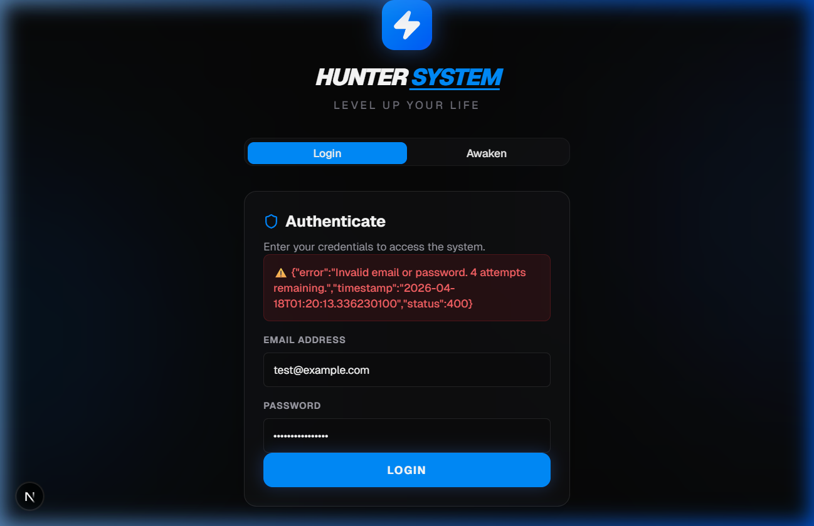
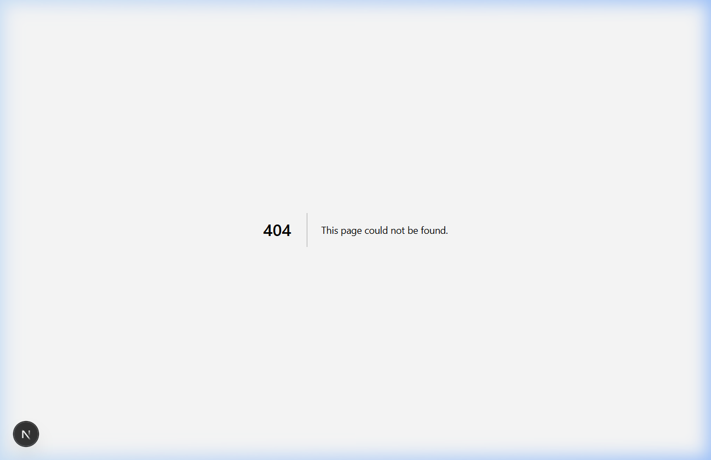

# ⚠️ System Error Logs & States

This folder contains screenshots and documentation of localized error states within the Hunter System.

## 📸 Captured Error States

### ❌ Authentication Error
Triggered when invalid credentials (email or password) are provided.

### 🚫 404 - Level Not Found
The system's custom 404 page for navigating to non-existent realms (routes).

## 🛠 Troubleshooting
If you encounter these errors:
1. **Auth Errors**: Verify your hunter credentials in the database or register a new account.
2. **404 Errors**: Ensure the frontend routing is correctly configured in `app/page.tsx`.
